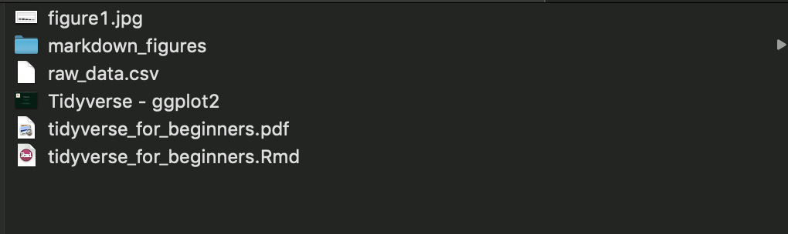
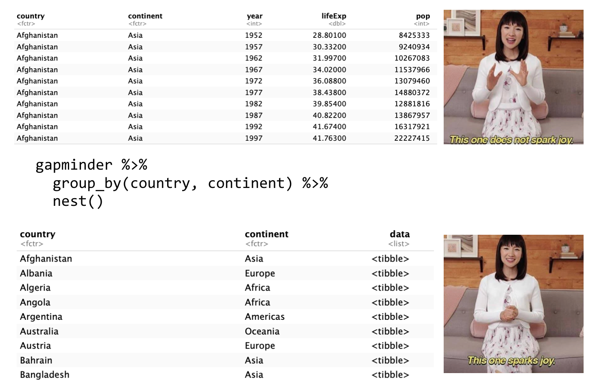

# Welcome! 

This Markdown file covers the material presented by Christina Van Heer at the 2019 Graduate Students in Psychological Sciences (GRIPs) Camp for 2019. If you are new to R, I'd recommend reading the following Resources section as we ran this workshop after students had gone over some basic R know-how. 

# Resources
This workshop is based on Hadley Wickham's "Many Models""tutorial, so don't go getting too excited, most of the stuff in this tutorial is covered in more depth [here](https://r4ds.had.co.nz/many-models.html) and I would recommend reading the whole book - ["R for data science"](https://r4ds.had.co.nz/) which is excellent 

If you want to learn more about R: 

- For a comprehensive introduction, Danielle Navarro has an excellent book for psychological scientists: https://learningstatisticswithr.com and there are some [online resources](https://psyr.org)

- Danielle also has a [tidyverse for beginners workshop](https://rladiessydney.org/littlemisstidyverse) and the links to slides are available on this website and also here, [have them now](https://slides.com/djnavarro/tidyverse-for-beginners)

- Software Carpentry have an [excellent tutorial](https://swcarpentry.github.io/r-novice-gapminder/) on the specific dataset used in this tutorial too

This tutorial is just a basic summary of some of the stuff here to get you started quickly with your data 


# Before you start

## R related installs 
You need a copy of the following on your computer:

- [The R coding language](https://cran.r-project.org)

- [RStudio](https://www.rstudio.com/products/rstudio/download/)

    - Note: a common beginners error is thinking RStudio and R are the same thing. They aren't! R is a language, like French, which allows you to "speak stats". R studio is a program which runs R (the language) and has stuff which makes it easier to use. It's like walking around Paris with a French interpreter, but you know, without any of the good stuff like pastry and croissants....wow I'm really selling this aren't I? 

## Packages in R
- Once you have downloaded R, we need to install a few extra bits of software to do some stats in R

- These are called "packages", which you can think of as special boxes which contain scripts (instructions) called "functions" which are like boxes that take our data, do something to it, and throw it out of the box, nice and shiny

- Note, R has a lot of built in packages (and functions) but we want some extra ones

- After you have installed R, ann R studio, double click on the RStudio program on your computer 

- Open it up and click on the Console 

```install.packages(c("tidyverse", "gapminder", "broom", "sjstats", "tibble"), dependencies = TRUE)```

- Say "yes" to anything that seeems sensible which pops up in the R console

## How to organise everything on your computer

- You should have the following things in a folder somewhere on your computer where you can easily navigate to it




## Setting up your working directory 

When we start up RStudio it is useful to setup R so it knows where it is looking 

- Session > Set Working Directory > To Source File Location 

The "source file location" in this context is the ***folder*** where you are storing this "tidyverse_for_beginners.Rmd" script. 


```{r setup}

rm(list = ls()) # remove all of the variables from your envrionment 

# Comment any of these out by putting a '#' in front of the line 
library(tidyverse) # loads the tidyverse set of packages 
library(gapminder) # loads the gapminder dataset 
library(broom) # broom is useful for cleaning up regression models 
library(sjstats) # sjs stats has a function which allows us to get standardised regression weights
library(tibble)
library(gridExtra) # for plotting 
```

# Setup your colour scheme 

Setup colour scheme for plotting later. I got these from the R cookbook website, they are two types of colourblind
palettes. These are called from ggplot by indexing the palette, e.g. color = cbPalette[1:3] uses colors 1-3 on the palette. 

The colour scheme isn't particularly appealing, but the goal isn't to have a Pantone book of plot colours, it's to make sure that everyone can see them. 
```{r}

# To use for line and point colors, add
# black, orange, blue, green, yellow, teal, red, pink
cbPalette <- c("#999999", "#E69F00", "#56B4E9", "#009E73", 
               "#F0E442", "#0072B2", "#D55E00", "#CC79A7")

# grey, orange, blue, green, yellow, teal, red, pink
cbbPalette <- c("#000000", "#E69F00", "#56B4E9", "#009E73", 
                "#F0E442", "#0072B2", "#D55E00", "#CC79A7")

```


# Data frames vs tibbles

- Data frames allow us to store information in rows and columns, in a very similar way to excel

    - We can store strings (words), numbers, etc in these 
    
- Tibbles allow us to store more versatile types of data in rows and columns

    - For example, if we fit a model, such as a regression and R gives us the fitted model back, we can store this as an "object" in a tibble
    
    - Tibbles are like data frames, but more versatile
    
```{r}

iris_data <- iris

iris_tibble <- as_tibble(iris)

iris_df <- data.frame(iris_data)

# Try typing these in the console 
head(iris_tibble)

head(iris_df)

```


# Creating a tibble 
```{r}

tibble(x = 1:5, y = 1, z = x ^ 2 + y)

```

# Learning the ways of the tidyverse force


## What the hell is the tidyverse anyway?

- In R, we use functions to perform operations on data 

    - You can think of a function as a box that takes something in, performs some operation on it (e.g. calculate the mean) and then spits something out (e.g. the mean)
    
    - e.g try - mean(c(10, 30, 25, 16) in your R console 
    
- Manipulating datasets in R can be difficult because the way different functions work 

- The idea behind tidyverse is that you have a set of packages which contain useful functions to help you manipulate data easily

- The packages work well with each other and allow you to shift the data between them easily

## The Gapminder dataset 

Let's start off by viewing the gapminder dataset 

To do this, we can just type "gapminder" in the R console 

- Because the gapminder dataset is a tibble, when we type "gapminder" (without the quotation marks) in the R console, it only prints out the first 10 rows

- This is because tibbles are optimised for printing 

```{r}

gapminder # display the gapminder dataset 

# Store the dataset in a variable called "gapminder"
gapminder <- gapminder

# Get column names
colnames(gapminder)

# What type of data this is e.g. tibble, data frame, list etc. 
class(gapminder)

```

# Tidyverse functions

## The group_by function
Often we want to run some data analysis/models based on a grouping of people. 

For example, we might want to run a model on a country, or continent basis. 

Let me show you what I mean with a more concrete example. Below, we are going to group the data by country and continent. This means R will first arrange the data frame in a way that grops all of the common continents and countries together. The "%>%" is referred to as a "pipe". You can think of a pipe in a literal sense. We are taking the data (in this case gapminder) and then funneling it to something else, doing that thing (in this case group_by) and then getting back the result. 


```{r group_by}

# Sort the data by country and continent 
gapminder %>%
  group_by(country, continent)

gapminder %>% 
  group_by(country, year)
```

## Arrange function
- Arrange sorts data out by a particular group

- Useful if you want to view your data in a particular way

- Putting a ‘-‘ sign = descending


```{r arrange}

gapminder %>% 
  arrange(year)

# -----------------
# These both sort in a 'descending' fashion 
gapminder %>% 
  arrange(-year)

gapminder %>% 
  arrange(desc(year))
# -----------------

gapminder %>% 
  arrange(desc(pop))


gapminder %>% 
  arrange(continent, country)
```

## Filter function

-Filter selects data which fulfils a particular rule 

-Useful if you want to do something to a selection of the data

-We usually use filter and then pipe the data onto another function with %>% 

```{r filter}

gapminder %>%
  filter(country == "Afghanistan")

gapminder %>% 
  filter(continent == "Europe")

gapminder %>% 
  filter(between(year, 1950, 1975))

gapminder %>% 
  filter(year > 1975)

```

## Select function

- Select allows you to select or get rid of specific columns of a tibble 

- Useful if you want to get rid of some columns

- We usually use select and then pipe the data onto another function with %>% 
```{r select}

gapminder %>%
  select(year, lifeExp) 
  
gapminder %>% 
  select(continent, lifeExp)

gapminder %>% 
  select(-continent, -lifeExp)
```


## Nesting data 

R allows you to group the data by factors which are common to the dataset, e.g. country, continent, subject number etc and then you can create a new table where each row is the grouping variable. The data is stored in a "box" in a row. Nesting is the process of creating this little box. 

For example the following code, gets the gapminder dataset, groups things by country and continent and then gets all of the data for each country and puts in a row of the tibble.

Note: you do not need to group by continent as well as country, this is just allowing continent to also appear as a column in the resulting tibble (so it is a column)

`gapminder.byCountry <- gapminder %>%
group_by(country, continent) %>%
nest()`



## Nesting example 
```{r nest}
gapminder.byCountry <- gapminder %>%
  group_by(country, continent) %>%
  nest()

gapminder.byCountry # display the result 
```

### What does nested data look like? 

Now, what we might want to do is look at a single nested column, i.e. the data for a single country 

We can use $ to select the "data" column, and then [[1]] selects the first element of the list, which is Afghanistan 


```{r}

gapminder.byCountry$data[[1]]

```


## Combining these functions and adding columns to a tibble 

```{r}

gapminder.byYear <- gapminder %>%
  group_by(year) %>%
  nest() 

# Notice that at the moment, year is just an integer (number)
# - we can convert this to a factor 
class(gapminder.byYear$year)

# Convert year to a factor 
gapminder.byYear$year <- as.factor(gapminder.byYear$year)

# Now we can re-check - notice "year" has been converted into a factor 
class(gapminder.byYear$year)

# Add a column which is the mean population for all countries by year 
gapminder.byYear <- gapminder.byYear %>%
  group_by(year) %>%
  unnest(data) %>% 
  summarize(meanPop = mean(pop)) %>% # calculate the mean 
  inner_join(gapminder.byYear, by = "year") # matches by year 

gapminder.byYear
```

# More adding columns 

We can also add columns to a table using the mutate function

```{r}

# Calculate the GDP for each country for each year 
gapminder %>%
  group_by(country, year) %>%
  mutate(gdp = pop * gdpPercap) %>% 
  ungroup() 

# Calculate mean life expectancy for each continent
gapminder %>% 
  group_by(continent, year) %>%
  summarize(meanlifeExp = mean(lifeExp)) 
  # nest(.) # look at the effect of adding "nest" here by removing the '#' sign in front of it 
  
```

Here, we are calculating the mean gdp for each country 

```{r}

# Calculate mean GDP per country 
gapminder %>% 
  select(-continent, -lifeExp) %>% # - sign removes these variables 
  mutate(gdp = pop * gdpPercap) %>% # add a column which calculates a new variable called gdp 
  group_by(country) %>% # group by country so that each row is a country 
  summarize(mean_gdp = mean(gdp)) # get the mean per country of the gdp column you just created 
  #ungroup() # ungroup by country 

```

# Fitting models to your data 
Here, we are going to fit a simple linear model 

- Tidyverse becomes hugely powerful when you use it to model your data

- You can store the data that you used to perform an analysis (data), the model you ran on it (fit) the predictions of the model (preds), summary stats like AIC, BIC, R^2^ etc. (summary.stats)

- Useful if you have multiple experiments, multiple models etc.

- Pipe %>% directly from the tibble with this info into ggplot2 (more detail later)

## A simple linear model 

In the section below, we are going to created a nested tibble where each row contains an entire continents data and we are going to store it in `gapminder.byContinent`

Then we are going to use a function called `map` which is part of the tidyverse. map takes a list (in this case the column called `data` is a list) and then applies a linear model to each element of the list, i.e. a particular continents data, stored in a row. We then use the mutate function to create a new column called "fit".

```{r}

gapminder.byContinent <- gapminder %>% 
  group_by(continent) %>%
  nest()

gapminder.byContinent  <- gapminder.byContinent %>% 
  mutate(fit = map(data, ~lm(gdpPercap ~ lifeExp + pop, data = .))) # run linear model and add the fit as a colum 

gapminder.byContinent # display the new tibble 

```


```{r}

gapminder.byCountry <- gapminder %>% 
  group_by(country, continent) %>%
  nest()

gapminder.byCountry <- gapminder.byCountry %>%
  mutate(
    fit = map(data, ~lm(lifeExp ~ year, data = .)),
    std.beta = map(fit, std_beta),
    preds = map(fit, augment),
    summary.stats = map(fit, glance),
    resids = map(fit, residuals)
  ) 

gapminder.byCountry

```

# Get a summary table with your beta weights 
```{r}

summary.Beta <- gapminder.byCountry %>% 
 unnest(std.beta, .drop = TRUE)

```


# Plotting R^2^
```{r fig.width = 3, fig.height = 5}

gapminder.byCountry %>% 
  unnest(summary.stats) %>% 
  ggplot(., aes(x = continent, y = adj.r.squared)) + geom_jitter()

```

# Looking at models in more detail 
- We can get the worst fitting models and look at in what year life exactancy declined the most 
- You can see that out of the worst fitting models, the Rwanda's life expectancy declines sharply just after 1990, the time of the Rwandan genocide. 
```{r fig.width = 9, fig.height = 4}

badfit <- gapminder.byCountry %>% 
  unnest(summary.stats) %>% # open up the summary.stats column 
  filter(., r.squared < 0.25) # Let's get the worst fitting models and store the result in badfit 

badfit %>%
  unnest(data) %>% # open up the data column
  ggplot(aes(x = year, y = lifeExp, colour = country)) + # plot year on the x-axis and life expectancy on the y axis 
  geom_line() + # add lines 
  xlab("Year") + ylab("Life Expectancy in Years") + # label the axes
  scale_colour_manual(name = "", values = cbbPalette[1:6]) + # legend settings - use the colorblind palette for colors (first 6 values)
  ggtitle("Life Expectancy for \n Worst Fitting Models Over Time") +  # plot title 
  theme(
    # Theme asthetics to make the plot look nicer 
    #legend.justification = c(1, 1), legend.position = c(1, 1),
    axis.text.x = element_text(size=7),  # size of text on the x axis 
    axis.text.y = element_text(size=7),  # size of text on the y axis 
    plot.title = element_text(hjust = 0.5, size = 13),  # title settings (note, centering requires h = 0.5)
    #plot.subtitle = element_text(hjust = 0.5), # subtitle settiings (note, centering requires h = 0.5)
    #plot.caption = element_text(hjust = 0, face = "italic"), # caption settings 
    #panel.grid.major = element_blank(), 
    #panel.grid.minor = element_blank(),
    #panel.background = element_blank(), 
    axis.line = element_line(colour = "black") # what colour you want the axes lines to be 
  )


```


# Part 2: ggplot2 workshop 
This next section uses a different dataset which I have simulated.
A set of observers did an experiment where they viewed faces (stim = 1) and houses (stim = 2), which were easy to see, sort of easy to see (difficulty = 2), very hard to see (difficulty = 3). They then rated how confident they were in their decision. We tested them on two separate days. 

## The data
The dataset consists of the following columns (variables):
- subj_no = subject code

- age = age in years

- day = the day of testing (1 or 2)

- stim = face (1) or house (2)

- trial = trial number 

- difficulty = stimulus was easy to see (1), moderately easy to see (2), or very hard to see (3)

- resp = response = did I say I saw a face (1) or a house (2)

- corr = correct (1) or incorrect (0), i.e. do the stim and response columns match (corr = 1) or not match (corr = 0)

- conf = how confident am I that I saw a face or a house from 1 (not confident) to 5 (very confident)

- RT = how long did I take to respond from when I saw the face/house until when I pressed a button to say it was a face or a house (RT = Response Time)

```{r load_data}  

data_dir <- getwd() #

data <- read.csv(file.path(data_dir,"raw_data.csv"), header=TRUE)
data <- as_tibble(data) # convert to a tibble 

# What if I want to change some column names, I hear you ask!! 
# I have commented this out because our script uses the names from the excel file
# you could do this names(data)[1] <- "col1" - this names the first column of data to "col1" and so on
# you could also do colnames(data) <- c("subj_no" = "sub_no", "stim" = "stimuli") - so we tell R that we 
# want to change "subj_no" to "sub_no" and so on - this way we dont have to remember which column the 
# thing we want is 

# Let's have a quick look at our data se we can see the column names etc 
data
```

## Step 1: Creating a space to plot 

The first thing you need to do is tell ggplot what data you want to plot

Notice how ggplot does not display anything except an empty plot space. This is because you have not told it what you want to plot on the x and the y axis, or anything else. 

You have just told it that you want to plot some aspect of "data", the tibble we have loaded, so it creates a space for plotting 


```{r create_plot_space, fig.width = 4, fig.height = 1.5} 

ggplot(data)

```

## Step 2: add an aesthetic (layer): x and y axis 

Now we can add the x and y axes using "aes" which stands for "asethetic". ggplot2 then labels the axes and preps the plot for adding some data on there. **But** we have not told ggplot2 whether want to plot the data (RT) as points, lines etc. So there is no data displayed yet. We need to add an extra layer, called a geometry layer. 

```{r fig.width = 4, fig.height = 1.5} 

# Tell ggplot what bits of the data you want to plot 
# ggplot data x = trial, y = RT
ggplot(data, aes(x = trial, y = RT)) 

```

## Step 3: add another layer

Now we can add the data, finally! We can add these as lines (the first example) or points (the second example)
```{r geom_points_RT, fig.width = 6, fig.height = 3}

ggplot(data, aes(x = trial, y = RT)) + geom_line() # lines 

ggplot(data, aes(x = trial, y = RT)) + geom_point(size = 0.5) # points
```


## Step 4: Add some colour 

We can also add some colours to our plot. Perhaps we want to colour the dots by the level of confidence people had in their responses. 

Remember, confidence is a column called "conf" in "data"

```{r add_colour, fig.width = 6, fig.height = 3}

data$conf <- as.factor(data$conf) # convert data to a factor 

ggplot(data, aes(x = trial, y = RT)) + geom_point(aes(colour = conf), size = 0.5)

```

## Step 5: change the aspects of the plot to make things look nicer 
```{r fig.width = 6, fig.height = 3}

ggplot(data, aes(x = trial, y = RT)) + geom_point(aes(colour = conf), size = 0.5) + 
  xlab("Trial no") + # x axis label 
  ylab("Reaction Time (seconds)") + # y axis label 
  # Legend settings 
  scale_color_manual(name = "Confidence Rating", # The name of the legend 
                     values = cbbPalette[1:5], # What colours we want to use: we are going to use the color blind palette we defined earlier 
                     labels = c("1 = very low conf", "2", "3","4","5 = very high conf")) + # labels for our legend 
  ggtitle("Response Times for Experiment 1") + 
  # Themes let us adjust things that we have setup in the plot like the legend and axes 
  # If you want to know more type "?theme" in the console (without the quotation marks)
  theme(
    axis.text.x = element_text(size=7),  # size of text on the x axis 
    axis.text.y = element_text(size=7),  # size of text on the y axis 
    plot.title = element_text(hjust = 0.5, size = 13)  # title settings hjust = 0.5 = center the title 
  )


```

# Plot types: bar plots 

Imagine I want to know what the frequencies of responses according to confidence ratings look like

Below I have plotted a simple bar plot. 
```{r bar_plot, fig.width = 4, fig.height = 3}

ggplot(data, aes(x = conf)) + geom_bar() # would just give me frequencies of confidence ratings

# Add colour 
ggplot(data, aes(x = conf)) + geom_bar(fill = "dark red") 
```

## Bar plots: getting fancy 

Below I have added labels to the x tick marks and removed some of the ugly pink background because it clashes with the dark red bars. We're all about being fashionable here!

```{r fig.width = 6, fig.height = 3}

# Labelling the xtick marks with confidence ratings (see below, under "theme" section)
ggplot(data, aes(x = conf)) + geom_bar(fill = "dark red") +
  xlab("Confidence Rating \n 1 (low) to 5 (high)") + ylab("Frequency") + 
  ggtitle("Experiment 1 : Confidence Rating Frequency") +    
  # ------- X TICK MARK LABELS ------- 
  scale_x_discrete(name = "", 
                   breaks = c("1", "2", "3", "4", "5"), 
                   labels = c("1 \n very low \n confidence", "2 \n low \n confidence", "3 \n medium \n confidence", "4 \n high \n confidence", "5 \n very high \n confidence")) + 
  # ----------------------------------
  # Themes let us adjust things that we have setup in the plot like the legend and axes 
  # If you want to know more type "?theme" in the console (without the quotation marks)
  theme(
    panel.background = element_blank(), # Get rid of the colouring background 
    axis.line = element_line(colour = "black"),
    axis.text.x = element_text(size = 10),  # size of text on the x axis 
    axis.text.y = element_text(size = 10),  # size of text on the y axis 
    plot.title = element_text(hjust = 0.5, size = 13)  # title settings hjust = 0.5 = center the title 
  )
```

# Histograms 

Say we want to plot our RT's. 

For a histogram we only need an x axis because the y axis is frequency. Ggplot2 knows this when we ask for a histogram.
```{r fig.width = 6, fig.height = 3}

ggplot(data, aes(x = RT)) + # 
  geom_histogram() + # create a histogram 
  xlab("Reaction Time (seconds)") + # x axis label 
  ylab("Frequency") + # y axis labels 
  ggtitle("Experiment 1") + # title 
  # Fancy stuff 
   theme(
    panel.background = element_blank(), # Get rid of the colouring background 
    axis.line = element_line(colour = "black"),
    axis.text.x = element_text(size = 10),  # size of text on the x axis 
    axis.text.y = element_text(size = 10),  # size of text on the y axis 
    plot.title = element_text(hjust = 0.5, size = 13)  # title settings hjust = 0.5 = center the title 
  )

```


## Adjusting bin size of histograms 

You may have noticed the following message that came up when you played that previous R chunk. 

"`stat_bin()` using `bins = 30`. Pick better value with `binwidth`."

What does this mean? We can control the number of data points that go into a single "bar" in the histogram. This is called a "bin". 

We can adjust the binsize, shown below. I have progressively reduced the bin size to make the plot more fine grained. 

```{r adjust_hist_bins, fig.width = 6, fig.height = 3}

ggplot(data, aes(x = RT)) + geom_histogram(binwidth = 0.2, fill = "red")

ggplot(data, aes(x = RT)) + geom_histogram(binwidth = 0.1, fill = "darkgreen")

ggplot(data, aes(x = RT)) + geom_histogram(binwidth = 0.05, fill = "magenta")

ggplot(data, aes(x = RT)) + geom_histogram(binwidth = 0.01, fill = "orange")

ggplot(data, aes(x = RT)) + geom_histogram(binwidth = 0.005, fill = "dark red")

```

We can make the final histogram look nice:

```{r fig.width = 6, fig.height = 3}

ggplot(data, aes(x = RT)) + # plot RT 
  geom_histogram(fill = "dark red", binwidth = 0.005) + # create a histogram 
  xlab("Reaction Time (seconds)") + # x axis labels 
  ylab("Frequency") + # y axis labels 
  ggtitle("Experiment 1") + # title 
  # Fancy stuff 
   theme(
    panel.background = element_blank(), # Get rid of the colouring background 
    axis.line = element_line(colour = "black"),
    axis.text.x = element_text(size = 10),  # size of text on the x axis 
    axis.text.y = element_text(size = 10),  # size of text on the y axis 
    plot.title = element_text(hjust = 0.5, size = 13)  # title settings hjust = 0.5 = center the title 
  )

```

# Density plots 

```{r density_plot, fig.width = 3, fig.height = 1.5}

# We could also get a density plot of our RT's 
ggplot(data, aes(x = RT)) + geom_density()

# We can also change the colours on this
ggplot(data, aes(x = RT)) + geom_density(fill = "red", # the filling of the density plot 
                                         colour = "red") # the colour of the outline of the density plot (note: try changing this to "black" and seeing what happens)

ggplot(data, aes(x = RT)) + geom_density(fill = "dark green", colour = "dark green") +
  ggtitle("Experiment 1") + # title 
  # Fancy stuff 
  theme(
    panel.background = element_blank(), # Get rid of the colouring background 
    axis.line = element_line(colour = "black"),
    axis.text.x = element_text(size = 10),  # size of text on the x axis 
    axis.text.y = element_text(size = 10),  # size of text on the y axis 
    plot.title = element_text(hjust = 0.5, size = 13)  # title settings hjust = 0.5 = center the title 
  )
```

# Other types of plots

## Violin plots and jitter plots 

Another thing I can do is store the plot in a variable called (in this case) "violin_plot".

Why is this useful? Now, I effectively have it stored in a box and can pull the violin plot out whenever I like and pair it with another plot in a grid, which I am going to do in the next section. 
```{r violin_jitter, fig.width = 4, fig.height = 2.5}

violinPlot <- ggplot(data, aes(x = conf, y = RT)) + geom_violin()
violinPlot 

jitterPlot <- ggplot(data, aes(y = RT, x = conf)) + geom_jitter() 
jitterPlot

```
# Plotting separate plots together 

I have stored the violin and jitter plots as variables. Using a package called "gridExtra" which has a function called grid.arrange(), I can pair these two together as subplots

We can store this plot in a variable called "figure1", which we are going to use when we save the plot below. 
```{r fig.width = 5, fig.height = 7}
figure1 <- grid.arrange(violinPlot, jitterPlot, 
             ncol = 1, nrow = 2) # you can try changing the row and column arrangement
```

# Plotting by condition or subject

Say we want to plot a separate plot for each subject. We have the subject numbers in a column of data called "subj_no"

Try typing "data$subj_no" (without the quotation marks) in your R console and you will see these 

We can use facet_wrap() in ggplot2 to tell it we want to separate plots

In our case, because we want separate plots for each subject, we use facet_wrap(~subj_no) where "~subj_no" means "by subject number"

```{r}

# Basic plot we did before, but now we plot one for every subject 
ggplot(data, aes(x = trial, y = RT)) + 
geom_point(aes(colour = conf), size = 0.5) + 
facet_wrap(~subj_no)

# Plot histograms of RT's for every subject 
ggplot(data, aes(x = RT)) + # plot RT 
  geom_histogram(fill = "black", binwidth = 0.05) + # create a histogram 
  xlab("Reaction Time (seconds)") + # x axis labels 
  ylab("Frequency") + # y axis labels 
  ggtitle("Experiment 1") + # title 
  facet_wrap(~subj_no) + # PLOT BY SUBJECT 
  # Fancy stuff 
   theme(
    panel.background = element_blank(), # Get rid of the colouring background 
    axis.line = element_line(colour = "black"),
    axis.text.x = element_text(size = 10),  # size of text on the x axis 
    axis.text.y = element_text(size = 10),  # size of text on the y axis 
    plot.title = element_text(hjust = 0.5, size = 13)  # title settings hjust = 0.5 = center the title 
  )


```

# Saving stuff 

- Before we ran this markdown file, we set our working directory to where it was stored using 

    - Session > Set Working Directory > To Source File Location

- We then stored this in a special variable called data_dir like this:

    - data_dir <- getwd() # get the working directory and store it in a variable called "data_dir"

    - data_dir # display the contents of the "data_dir" variable 

- If you type these two lines into your console, you will get something like:

    - "~/Bitbucket_public_repo/2019_PhDcamp" - which is where the Markdown file is stored on your computer 

    - "getwd()" gets the directory that R is looking at (which is the one we setup before), which is called the working directory

- We can create a "path" or address that R can store our files using a function called "file.path":

    - file.path(data_dir, "figure1.jpg") where data_dir is the path / address where this Markdown file is and "figure1.jpg" is the name of the file you're creating 

- Try typing the following line into your console, which creates a path to the new file (not physically on your computer, it just creates a string): 

    - file.path(data_dir,"figure1.jpg")

We can then use this string as the filename when we save stuff below, and if it saves correctly, you will notice that figure1.png saves in your folder 

```{r save_stuff}
ggsave(filename = file.path(data_dir,"figure1.jpg"),  # needs to be a full path
       plot = figure1, 
       width = 10, 
       height = 5)
 
```

# Back to gapminder

Let's go back to our original gapminder dataset to put together what we have learnt about tidyverse with what we have learnt about ggplot. We can group data, created nested datasets according to continents, add new columns, and then pipe the result into ggplot to get a plot!! 
```{r fig.width = 6, fig.height = 3}

gapminder %>% # start with the gapminder dataset 
  group_by(continent) %>% # group rows by continent 
  nest() %>% # put all data (columns) for a single continent into a row so it is "nested"
  unnest(data) %>% # ok, well now unnest that because we need to do some plotting 
  ggplot(aes(x = year, y=lifeExp, group = country)) +  # plot year on the x axis and life expectancy on the y axis, and group any lines or dots by country so that we are plotting countries on a single line 
  geom_line(aes(color = country)) + # draw the lines and color each country a different color
  facet_wrap(~continent) + # make individual plots for each continent 
  ggtitle("Life Expectancy by Continent") + # give the plot a title 
  theme(
    legend.position = "none", # the legend would consist of ALL countries ARGH too big, get rid of it! 
    axis.text.x = element_text(size=7),  # size of text on the x axis 
    axis.text.y = element_text(size=7),  # size of text on the y axis 
    plot.title = element_text(hjust = 0.5, size = 13)  # title settings (note, centering requires hjust = 0.5)
  )

```
